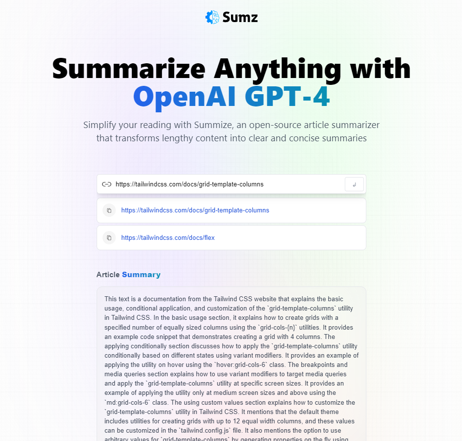

# AI-Summarizer

AI-Summarizer is an open-source web application that leverages OpenAI's GPT-4 to summarize articles. It's built using React, Redux Toolkit, and Tailwind CSS, and is designed to simplify your reading by transforming lengthy content into clear and concise summaries.

## Features

- **Article Summarization**: Enter a URL and get a summarized version of the article.
- **URL History**: Keeps track of all the articles you've summarized.
- **Clipboard Support**: Easily copy summarized articles or URLs to the clipboard.
- **Responsive Design**: Works well on various screen sizes.

## Table of Contents

1. [Installation](#installation)
2. [Usage](#usage)
3. [Technologies](#technologies)
4. [Contributing](#contributing)
5. [License](#license)

## Installation

1. Clone the repository:

git clone https://github.com/alexlux58/AI-Summarizer.git

2. Navigate to the project directory:

cd AI-Summarizer

3. Install dependencies:

npm install

4. Run the development server:

npm run dev

## Usage

1. Open the application in your browser.
2. Enter the URL of the article you want to summarize in the input field.
3. Click the submit button to get the summary.
4. You can also copy the URL or summary to the clipboard.

## Technologies

- **React**: For building the UI components.
- **Redux Toolkit**: For state management.
- **Tailwind CSS**: For styling.
- **Vite**: For build tooling.

## Contributing

Pull requests are welcome. For major changes, please open an issue first to discuss what you would like to change.

## License

This project is open-source and available under the MIT License.
